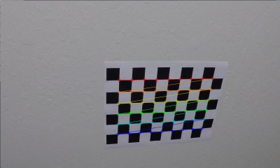
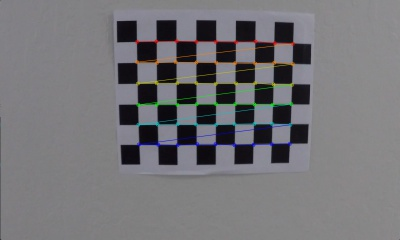

## Advanced Lane Finding Project
[](http://www.udacity.com/drive)

This project utilizes a software pipeline to identify the lane boundaries in a video.

The goals / steps of this project are the following:

* Compute the camera calibration matrix and distortion coefficients given a set of chessboard images.
* Apply a distortion correction to raw images.
* Use color transforms, gradients, etc., to create a thresholded binary image.
* Apply a perspective transform to rectify binary image ("birds-eye view").
* Detect lane pixels and fit to find the lane boundary.
* Determine the curvature of the lane and vehicle position with respect to center.
* Warp the detected lane boundaries back onto the original image.
* Output visual display of the lane boundaries and numerical estimation of lane curvature and vehicle position.

The images for camera calibration are in the `camera_cal` folder.  The images in `test_images` are used in testing the pipeline on single frames.  Examples of the output from each stage of the pipeline are the `ouput_images` folder.  The video `project_video.mp4` is target video for the lane-finding pipeline.  Each rubric step will be documented with output images and usage.

## [Rubric Points](https://review.udacity.com/#!/rubrics/571/view)

**Camera Calibration**
1) Have the camera matrix and distortion coefficients been computed correctly and checked on one of the calibration images as a test?

The code for this step is contained in the file called `camera_calibration.py`
```
usage: camera_calibration.py [-h] [-show] [-save]

Camera calibration for Udacity Advanced Lane Finding project

optional arguments:
  -h, --help  show this help message and exit
  -show       Visualize data calibration
  -save       Save calibration images
```
This script loads calibration images of chessboards taken at different angles.  Each image is grayscaled and sent into `cv2.drawChessboardCorners`.  The resulting "object points" are the (x, y, z) coordinates of the chessboard corners in the world.

For each set of corners, the output is displayed and shown to the user (if specified).  The image is also saved to disk (if specified).
  
Finally the corner points are sent to `cv2.calibrateCamera` to get resulting image points and object points.  This dictionary is then saved for reuse in undistorting other images in the pipeline.

 
<table>
<tr>
<td><a href="https://github.com/justinlee007/CarND-Advanced-Lane-Lines/blob/master/output_images/chessboard1.jpg"></td>
<td></td>
</td>
</table>
